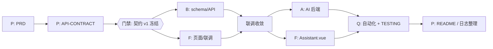

# Agent 协作日志

本项目采用「一人 + 多 Agent」协同开发。下文含协同方案总览、按时间排序的任务留痕、协同复盘，以及 Git 提交对照表，供评审交叉验证。

---

## 一、协同方案总览

### 1.1 协同模型：阶段性并行 + 契约门禁

| 做法 | 取舍 |
|------|------|
| **不用全并行** | 人类 review 是单线程瓶颈。若 P/B/F/A 四路同时狂写，要么来不及审只能盲目接受，要么排队等审导致 Agent 空转；无冻结契约时并行还会各自猜字段。 |
| **不用全串行** | 契约冻结后，`server/` 与 `client/` 本就可目录隔离并行；全串行会浪费这段唯一高价值窗口，3 小时时间盒里挤不出联调与测试。 |
| **实际采用** | 规划阶段 P **串行**产出 PRD → 契约；**门禁**：契约 v1 冻结；之后 B∥F 双 Tab 并行；联调收敛后 A（后端 AI）∥F（`Assistant.vue`）；最后 Q 验收；交付由 P 整理 README / 本日志。 |

### 1.2 角色编制表

| 代号 | 角色 | 职责 | 可写目录 | 约束载体 | 前置依赖 |
|------|------|------|----------|----------|----------|
| P | 规划 | 需求、契约、任务拆解、验收口径、交付文档 | `docs/`、根目录 markdown；可追加本日志 | `.cursor/rules/10-planner.mdc` + `00-global.mdc` | 无（最先） |
| B | 后端 | schema、分层 API、校验、db 脚本 | 仅 `server/`；阶段 5 可改根 `package.json` 的 `db:*` scripts；可追加本日志 | `.cursor/rules/20-backend.mdc` + `00-global.mdc` | 契约冻结（至少 P0） |
| F | 前端 | 页面、路由、联调；**含 `Assistant.vue`** | 仅 `client/`；可追加本日志 | `.cursor/rules/30-frontend.mdc` + `00-global.mdc` | 契约冻结；联调需 B 接口 |
| A | AI | DeepSeek + Mock 降级（**仅后端**） | `server/src/ai/`、`routes/ai.js`、`controllers/aiController.js`；`index.js` 仅挂载最小改动；**禁改 client/**；可追加本日志 | `.cursor/rules/40-ai.mdc` + `00-global.mdc` | 契约 AI 节冻结 |
| Q | 测试 | Vitest/Supertest、`TESTING.md` | `server/tests/`、`vitest.config.js`、根 `TESTING.md`；脚手架可微改 `index.js`/`db.js`；**不改业务逻辑**；可追加本日志 | `.cursor/rules/50-qa.mdc` + `00-global.mdc` | P0 API 可测 |

全局红线（无登录、技术栈、契约唯一事实来源、snake↔camel、金额/日期约定）见 `.cursor/rules/00-global.mdc`。

### 1.3 协同时序

文字版：规划 P 串行产出契约 → **契约 v1 冻结（门禁）** → 后端 B 与前端 F 双 Tab 并行（目录隔离）→ 联调收敛（含跨模块 bug 由人路由）→ AI Agent A（后端）+ 前端完成 `Assistant.vue` → 测试 Q → 交付整理。

### 1.4 冲突防控机制

| 机制 | 做法 |
|------|------|
| 目录隔离 | 各角色 rules 写死可写范围；越界修改在 review 时拒绝 |
| 共享追加例外 | 所有角色可追加根目录 `AGENT_LOG.md`，不算目录越界 |
| 契约唯一事实来源 | `docs/API-CONTRACT.md` v1；字段/路径/状态码不得私下假设 |
| 越界即拒绝 | 例如 A 不得改 `Assistant.vue`；Q 不得改业务 SQL/Prompt；发现 bug 报告给对应角色 |
| 跨域 bug 人类路由 | 如 Q 测出 DATE 偏移 → 交接给 B；AI 404 → 交接给 A；不由单一 Agent 擅自改对方目录「顺手修完」 |

---

## 二、任务记录（按时间排序，保留原始事实）

> 格式统一为：时间 / Prompt 摘要 / 产出文件 / 关键决策 / 自检结果 / 交接条件。  
> Prompt 摘要已精简，但保留关键约束；**未删除任何历史任务条目**。

<!-- 记录格式模板：

### [角色代号] 任务标题
- **时间**：HH:MM
- **Prompt 摘要**：
- **产出文件**：
- **关键决策**：
- **自检结果**：
- **交接条件**：

-->

### [P] 撰写 PRD.md（需求与规划文档）
- **时间**：16:36
- **Prompt 摘要**：撰写评审用 `docs/PRD.md`：四模块与红线、三实体硬约束、P0/P1/P2、180 分钟时间盒、五 Agent 边界、可勾选验收、风险应对；追加本日志。
- **产出文件**：`docs/PRD.md`
- **关键决策**：
  - 费用 MVP 不做编辑接口（删旧建新），写入范围边界防误判缺功能
  - 「阶段性并行 + 契约门禁」；A 只做后端 AI，`Assistant.vue` 归 F；Q 仅脚手架最小改动；B 阶段 5 可改根 `package.json` 的 db:* scripts
  - P0 不可砍；P1 可砍「导入」；P2 可全砍；级联删除 trip → spots/expenses
- **自检结果**：八章齐全；红线含「3 小时放弃理由」；验收含 DeepSeek/Mock；未改业务代码
- **交接条件**：评审通过后由 P 冻结 `docs/API-CONTRACT.md`，再开 B/F/A

### [P] 撰写并冻结 API-CONTRACT.md（v1）
- **时间**：16:37
- **Prompt 摘要**：撰写前后端唯一事实来源；全量接口 + 可复制 JSON 示例；日志须写明「契约已冻结，版本 v1」。
- **产出文件**：`docs/API-CONTRACT.md`
- **关键决策**：
  - **契约已冻结，版本 v1**
  - 成功无 envelope；失败统一 `{ error: { code, message } }`
  - AI `suggest`：请求体字段优先于 `tripId` 补齐；模型失败一律 200 + Mock；`tips` ≥ 3
- **自检结果**：接口齐全；示例为合法 JSON；未改业务代码
- **交接条件**：B / F / A 可按目录隔离并行开发

### [P] 契约 v1 正式冻结确认
- **时间**：16:39
- **Prompt 摘要**：核对通过后正式冻结；顶部加冻结声明（含时间）；后续变更须明确指令并记入变更记录表。
- **产出文件**：`docs/API-CONTRACT.md`（顶部冻结声明 + §8 时间落定）
- **关键决策**：
  - **契约 v1 冻结**（2026-08-10 16:39 UTC+8）
  - **B 与 F 可以开始并行开发**
  - 任何契约变更须负责人明确指令 → P 更新 + 变更记录 + 本日志
- **自检结果**：顶部与 §8 时间一致；未改接口正文、未改业务代码
- **交接条件**：B / F 按契约并行；歧义回 P

### [B] 创建数据库层（schema + seed + db 脚本）
- **时间**：16:45
- **Prompt 摘要**：按契约/PRD 建 `schema.sql`/`seed.sql`；更新根 `package.json` 的 `db:init`/`db:reset`；确认 `db.js` NUMERIC→number。
- **产出文件**：`server/db/schema.sql`、`server/db/seed.sql`、根 `package.json`（仅 scripts）、`AGENT_LOG.md`
- **关键决策**：
  - 三表 CHECK/级联与契约对齐；`estimated_cost` DEFAULT 0
  - schema 开头 `DROP ... CASCADE` 可重复执行；外键列建索引 + COMMENT
  - seed 用子查询取行程 id，避免硬编码 SERIAL
  - `db:*` 用 `psql -U postgres -d tripmate`；密码依赖 `PGPASSWORD`/pgpass
  - `db.js` 已有 OID 1700 `parseFloat`，本次未改
- **自检结果**：表结构与 PRD/契约一致；未改 `client/`、未改 dependencies、未创建 `.env`
- **交接条件**：已建库 `tripmate` 且 `psql` 可用后执行 `npm run db:init`，再实现 API

### [B] 修复 db:init Windows 中文编码错误
- **时间**：16:48
- **Prompt 摘要**：`npm run db:init` 报 GBK→UTF8 无对应字符；修复 SQL/脚本编码。
- **产出文件**：`server/db/schema.sql`、`server/db/seed.sql`、根 `package.json`（仅 db:*）、`AGENT_LOG.md`
- **关键决策**：
  - SQL 开头 `SET client_encoding TO 'UTF8';`
  - scripts 增加 `PGCLIENTENCODING=UTF8` 与 `-v ON_ERROR_STOP=1`
- **自检结果**：与编码报错对齐；本环境因缺密码未完整复跑，需本机再执行
- **交接条件**：根目录重跑 `npm run db:init` 应无 GBK 报错；成功后三表+种子就绪

### [B] 实现行程模块完整后端 API
- **时间**：16:50
- **Prompt 摘要**：按契约实现 trips 五接口；分层 repo/controller/routes，挂载 `index.js`。
- **产出文件**：`server/src/repositories/tripRepo.js`、`controllers/tripController.js`、`routes/trips.js`、`index.js`、`AGENT_LOG.md`
- **关键决策**：
  - `mapTripRow` snake→camel；DATE 格式化为 `YYYY-MM-DD`；budget 保留两位
  - 手写校验；错误 `next(err)`；DELETE 204；路由挂在 404 前
- **自检结果**：`node --check` 通过；与契约 §2 对齐；参数化 SQL；未改 client/
- **交接条件**：db 就绪后可 curl 验五接口；后续接 spots/expenses

### [F] 实现整体布局与行程模块前端
- **时间**：16:50
- **Prompt 摘要**：trips API 封装、App 布局、路由、TripList CRUD；Assistant 占位；删 Home.vue。
- **产出文件**：`client/src/api/trips.js`、`App.vue`、`main.js`、`router/index.js`、`views/TripList.vue`、`TripDetail.vue`、`Assistant.vue`（占位）、`styles/theme.css`、`client/package.json`（`@element-plus/icons-vue`）、删除 `Home.vue`、`AGENT_LOG.md`
- **关键决策**：
  - 字段严格 camelCase；金额 `¥`+两位小数；日期 `value-format="YYYY-MM-DD"`
  - 列表卡片网格；删除二次确认含级联提示；详情仅基础信息；Assistant 占位文案
- **自检结果**：请求均经 `http.js`；空态/loading/校验齐全；未改 `server/`
- **交接条件**：后端 trips 就绪即可联调；详情页后续接景点/费用

### [B] 实现景点与费用模块（含 summary）
- **时间**：16:55
- **Prompt 摘要**：spots/expenses/summary；PATCH 白名单；bulk 事务；summary GROUP BY；注意路由顺序。
- **产出文件**：`spotRepo.js`、`expenseRepo.js`、`spotController.js`、`expenseController.js`、`routes/spots.js`、`routes/expenses.js`、`index.js`、`AGENT_LOG.md`
- **关键决策**：
  - 先挂 `/:tripId/spots|expenses|summary`，再挂资源级路由
  - bulk：`BEGIN/COMMIT/ROLLBACK`；PATCH 列名仅白名单
  - `usageRate` 按契约；金额四舍五入到分
- **自检结果**：与契约 §3–§4 对齐；未改 client/
- **交接条件**：可 curl 验 summary（重点 `/api/trips/1/summary`）

### [F] 实现行程详情页（景点/费用/预算概览）
- **时间**：16:55
- **Prompt 摘要**：封装 spots/expenses；重写 TripDetail（预算概览+两表）；统一 `formatMoney`；费用变更后刷 summary。
- **产出文件**：`client/src/api/spots.js`、`expenses.js`、`utils/format.js`、`views/TripDetail.vue`、`TripList.vue`（共用 formatMoney）、`AGENT_LOG.md`
- **关键决策**：
  - `Promise.all` 并行加载；overBudget 红条；usageRate≥0.8 橙提示；byCategory 用 tag
  - 景点状态 switch 即时 PATCH，失败回滚；费用增删后必刷 summary
- **自检结果**：枚举/日期与契约对齐；未改 server/
- **交接条件**：后端 spots/expenses/summary 就绪即可联调详情全流程

### [B] 修复 ESM 下 dotenv 加载过晚导致 SASL 报错
- **时间**：17:02
- **Prompt 摘要**：重启后 `client password must be a string`；排查并修复。
- **产出文件**：`server/src/env.js`、`db.js`、`index.js`、`AGENT_LOG.md`
- **关键决策**：
  - 根因：ESM `import` 提升使 Pool 早于 `dotenv.config()`，`DATABASE_URL` 为 undefined
  - 新增 `env.js`，在 `db.js`/`index.js` 首行 import；缺 URL 启动即抛错
- **自检结果**：可查出种子行程 id=1；未改 `.env`、未改 client/
- **交接条件**：重启 server 后 spots/summary 不再 SASL

### [Q] 搭建 Vitest 验收测试与 TESTING.md（成都三日游主路径）
- **时间**：17:10
- **Prompt 摘要**：演示脚本 5 步 API 集成测试；遵守 50-qa 范围；发现业务 bug **只报告不改**。
- **产出文件**：`server/tests/*`、`vitest.config.js`、`TESTING.md`；脚手架改 `index.js`（导出 app、test 不 listen）、`db.js`（`TEST_DATABASE_URL`）；`AGENT_LOG.md`
- **关键决策**：
  - 主路径用 API 测表达验收语义；UI 红条等写入手测清单
  - `setupFiles` + `fileParallelism: false`；每文件 schema + TRUNCATE
- **自检结果**：当时 **4 通过 / 2 失败**：演示路径与 expenses-summary 通过；`trips-crud` 因 **DATE 回读少一天**失败；`ai-suggest-mock` 因 **路由未挂载 404**失败。未改业务逻辑
- **交接条件**：
  - **→ B**：`formatDateOnly` 在 UTC+8 下少一天；请改日期映射，勿动测试期望
  - **→ A**：`POST /api/ai/suggest` 未挂载；实现后无 Key 应 200 + `source=mock`
  - 需存在库 `tripmate_test` 与 `TEST_DATABASE_URL`

### [Q+B/A] 修复 DATE 时区偏移与 AI suggest，测试全绿
- **时间**：17:13
- **Prompt 摘要**：针对 Q 报告的 DATE 少一天与 AI 404，在同一收敛窗口修复并重跑测试。（本条为跨角色修复合记，见复盘说明。）
- **产出文件**：`server/src/db.js`（DATE OID 1082→字符串）、`tripRepo.js`/`expenseRepo.js`、`server/src/ai/*`、`aiController.js`、`routes/ai.js`、`index.js`（挂载 `/api/ai`）、`AGENT_LOG.md`
- **关键决策**：
  - DATE：驱动层保持 `YYYY-MM-DD` 字符串，避免 UTC+8 下 Date+getUTC* 少一天
  - AI：无 Key/超时/非 2xx/JSON 或 schema 失败 → 200 + mock + `fallbackReason`
- **自检结果**：当时 `npm test` → **4 files / 6 tests 全部通过**
- **交接条件**：可继续前端 AI 联调；真调需有效 `DEEPSEEK_API_KEY`

### [A] 实现 POST /api/ai/suggest（DeepSeek + Mock 降级）
- **时间**：17:18
- **Prompt 摘要**：按契约实现建议接口；schema/mock/deepseek 编排；参数优先级与 tripId 补齐；**永不 5xx**。
- **产出文件**：`server/src/ai/schema.js`、`mock.js`、`deepseek.js`、`index.js`、`aiController.js`、`routes/ai.js`；删除旧 `validateSuggestData.js`/`buildMock.js`/`deepseekClient.js`；`AGENT_LOG.md`
- **关键决策**：
  - `getSuggestion` 捕获失败并 Mock；`fallbackReason` 区分原因
  - Mock 与 destination/days/budget 相关；tips 恰好 3 条；JSON 模式 + fence fence；AbortController 超时
- **自检结果**：无 Key → 200 + `source=mock`；`/api/ai` 已挂载
- **交接条件**：前端可联调 Assistant；有效 Key 可真调

### [F] 实现 AI 助手页 Assistant.vue
- **时间**：17:20
- **Prompt 摘要**：`getSuggestion`（25s 超时）；输入/结果区（来源徽章、日程、预算、贴士）；bulk 导入；错误可重试。
- **产出文件**：`client/src/api/ai.js`、`views/Assistant.vue`、`AGENT_LOG.md`
- **关键决策**：
  - AI 单独 timeout 25000；表单字段优先，行程选择仅预填
  - 强制展示 deepseek/mock 徽章；导入映射 name/type/estimatedCost + status 待去
- **自检结果**：与契约 §5 对齐；不白屏；未改 server/
- **交接条件**：suggest + bulk 就绪即可联调；无 Key 应见 Mock 徽章

### [A] 优化 DeepSeek 超时降级（max_tokens + 超时读取）
- **时间**：17:25
- **Prompt 摘要**：真调报「请求超时（15 秒）」；探测可达后收紧生成并加固 Abort 判断。
- **产出文件**：`server/src/ai/deepseek.js`、`AGENT_LOG.md`
- **关键决策**：
  - 实测完整 2 日建议约 6s；15s 在慢网偏紧
  - `max_tokens: 4096`、提示词要求简洁；建议 `.env` 将 `DEEPSEEK_TIMEOUT_MS` 调到 30000/45000
- **自检结果**：本机 callDeepSeek(成都/2日) 约 6s 成功；未改 CRUD、未改 client/
- **交接条件**：重启 server；可选加大超时；失败仍 Mock 200

### [Q] 按规格重写核心 API 自动化测试与 TESTING.md
- **时间**：17:28
- **Prompt 摘要**：Vitest+Supertest；独立 `tripmate_test`；四文件覆盖 trips/expenses/spots/ai；重写 TESTING.md；不改业务逻辑。
- **产出文件**：`server/tests/setup.js`、`trips.test.js`、`expenses.test.js`、`spots.test.js`、`ai.test.js`、`vitest.config.js`、`TESTING.md`、`AGENT_LOG.md`；删除旧 acceptance/helpers 等
- **关键决策**：
  - `index.js`/`db.js` 脚手架已具备，**本次未再改**
  - AI 用 `vi.stubEnv` 清空 Key；级联用 pool COUNT；日期断言等于请求原值
  - 用例表对齐赛题第九节 / PRD §7
- **自检结果**：`npm test` → **4 files / 15 tests 全部通过**；未改业务校验/SQL/AI Prompt
- **交接条件**：评审按 TESTING.md §5 手测；自动化以 `npm test` 为准

### [P] 撰写根目录 README.md（评审快速启动）
- **时间**：17:35
- **Prompt 摘要**：目标 5 分钟见主界面；PowerShell 可复制步骤；DEEPSEEK 降级说明与验证法；FAQ≥4；文档索引。
- **产出文件**：`README.md`
- **关键决策**：
  - 命令对齐 `install:all` / `db:init` / `dev` / `test` 与 `.env.example`
  - 强调 Key 可留空、Mock 不阻塞主流程；密钥仅本地且已 gitignore
- **自检结果**：步骤可复制；未改 server/client；四链文档索引齐全
- **交接条件**：干净机器按 README 即可打开 http://localhost:5173

### [P] 整理并补全 AGENT_LOG.md（协同材料）
- **时间**：17:36
- **Prompt 摘要**：保留全部原始记录；补协同总览、格式校对、复盘四问、Git 对照表；事实可验证、不编造。
- **产出文件**：`AGENT_LOG.md`
- **关键决策**：
  - 记录按时间重排，不删条目；Prompt 只做精简
  - 复盘只写日志/git 可印证的事实（含 DATE/AI 路由、契约未再变更、合记条目说明）
- **自检结果**：总览/编制表/时序/防控齐全；对照表与 `git log --oneline` 可交叉；未改业务代码
- **交接条件**：评审可用本文件 + `git log --oneline` 核对协同过程

---

## 三、协同复盘

### 3.1 哪些环节 Agent 表现好

- **契约门禁后字段对齐**：v1 冻结后 B/F 并行（同刻 16:50、16:55 双条记录），API JSON 一律 camelCase、枚举中文值与契约一致；联调阶段**没有出现「为对齐字段去改契约」的变更记录**（见 `docs/API-CONTRACT.md` §7 变更表仍为空）。
- **目录隔离基本守住**：F 条目反复写「未改 server/」；A 写「未改 client/」；Q 首轮失败时**只报告不改业务**（DATE → B，AI 404 → A），符合 50-qa 红线。
- **降级与金额硬约束落地**：NUMERIC→number、AI 失败仍 200+Mock、费用 summary/`overBudget` 有对应用例；最终 `npm test` 15 项全绿（见 [Q] 17:28）。

### 3.2 哪些环节需要人工干预

- **跨域 bug 必须人路由**：Q 17:10 测出 DATE 少一天与 AI 未挂载；人类把问题分给 B/A，而不是让 Q 改 `tripRepo` 或让 F 猜字段。随后 17:13 出现 **[Q+B/A] 合记**——同一收敛窗口里改了 db 日期解析并挂上 AI，对应 git 上的 `528aeaf`（单 commit 含测试 + AI 初版 + DATE 修复）。这说明「路由」有效，但也暴露合记/合提交会削弱角色边界清晰度。
- **环境类问题靠人排查再现**：Windows 下 `db:init` GBK 编码（B 16:48）、ESM 下 dotenv 加载过晚致 SASL（B 17:02），需要本机复现与密码/`PGPASSWORD` 配合，不是纯「改业务逻辑」能关闭。
- **真调超时需人拍板参数**：A 17:25 实测后建议把 `DEEPSEEK_TIMEOUT_MS` 提到 30s/45s——改 `.env` 属于本地配置，由人决定是否采纳。
- **日志并发追加曾丢段**：并行 Tab 同时写 `AGENT_LOG.md` 时出现过后写覆盖、条目短暂丢失，需人核对后补回（本整理任务亦包含时间重排）。属共享文件的固有风险。

> 说明：日志中**没有**「某 Agent 被发现改了对方业务目录并被打回」的独立事件记录；防控更多体现在规则写死 + 自检声明「未改对方目录」+ Q 拒改业务。复盘不编造越界事故。

### 3.3 契约门禁的实际效果

- **冻结后未发生契约正文变更**：`docs/API-CONTRACT.md` §7「契约变更记录」仍为初始空表；无 P 条目记载「改路径/改字段」。实现侧问题（日期映射、dotenv、超时）都在**实现层**解决，没有靠改契约蒙混。
- **门禁价值**：B/F 能按同一份示例 JSON 并行；Q 断言直接对照契约状态码与 `source`/`usageRate` 算法，返工点集中在实现 bug 而非「前后端口径不一」。

### 3.4 如果重来一次会怎么改进协同方式

1. **契约冻结后再开 B/F Tab**，避免「契约未落盘时 B 已按 PRD 开写」的短暂窗口（本项目早期 B 与 P 时间戳有交错，靠后续对齐契约收口）。
2. **跨角色修复强制拆 commit / 拆日志**：DATE 归 B、AI 挂载归 A、测试变绿归 Q，各写一条，少用 `[Q+B/A]` 合记，便于评审按角色追问。
3. **Q 介入时机**：等 AI 路由挂上再跑 AI 用例，或先跳过 AI，减少「已知 404」噪声；DATE 用例尽早用 UTC+8 机器跑一次冒烟。
4. **`AGENT_LOG.md` 追加约定**：每次追加前先读文件末尾，或由人串行确认写入，降低并行覆盖。
5. **交付文档与代码同批提交**：README / 本整理日志若晚于功能 commit，对照表会出现「工作区未入 git」行（见下表），重来应在交付门禁一次提交。

---

## 四、Git 提交与 Agent 记录对照表

> 生成时仓库 `git log --oneline` 如下（新→旧）。请用同命令交叉验证。  
> 说明：早期脚手架 commit 无五角色任务条目；`README.md` 与本整理若尚未 push，表中单独标明。

| Commit | Message | 对应角色 | 对应本日志条目 |
|--------|---------|----------|----------------|
| `8d8218e` | test(qa): vitest suite for trips crud, expense summary, cascade delete and ai fallback | Q | [Q] 按规格重写核心 API 自动化测试与 TESTING.md（17:28） |
| `d219a7e` | feat(ai): deepseek json-mode integration with graceful mock fallback and source badge | A + F | [A] 实现 POST /api/ai/suggest（17:18）；[A] 优化 DeepSeek 超时（17:25）；[F] 实现 Assistant.vue（17:20） |
| `528aeaf` | fix: resolve cross-module integration issues in trips/spots/expenses flow | Q + B/A（合提交） | [Q] 搭建 Vitest…（17:10，含失败交接）；[Q+B/A] 修复 DATE 与 AI suggest（17:13） |
| `64f4deb` | feat(frontend): trip list, trip detail with spots, expenses and budget overview | F | [F] 整体布局与行程模块（16:50）；[F] 行程详情页（16:55） |
| `25a141d` | feat(backend): trips/spots/expenses CRUD and budget summary API | B | [B] 行程 API（16:50）；[B] 景点与费用+summary（16:55）；[B] dotenv 修复（17:02） |
| `b49fd17` | feat(db): add trips/spots/expenses schema, seed, and Windows-safe db scripts | B | [B] 创建数据库层（16:45）；[B] 修复 db:init 编码（16:48） |
| `8dba75d` | docs: add PRD and freeze API contract v1 | P | [P] PRD（16:36）；[P] API-CONTRACT（16:37）；[P] 正式冻结确认（16:39） |
| `bbde204` | chore(agents): define 6 cursor rules for planner/backend/frontend/ai/qa roles | （规则预置） | 无任务条目；角色约束见「一、协同方案总览」编制表 |
| `5ff8be3` | Add package.json and package-lock.json … concurrently | 脚手架 | 无五角色任务条目 |
| `213ce6c` | Add Express server and Vue client project scaffolds | 脚手架 | 无五角色任务条目 |
| `713b792` | Initialize tripmate-lite scaffold with env template and agent log | 脚手架 | 创建空日志壳；后续条目由此文件演进 |

| 工作区 / 待提交 | 说明 | 对应角色 | 对应本日志条目 |
|-----------------|------|----------|----------------|
| `README.md`（整理时未出现在上述 `git log`） | 评审快速启动文档 | P | [P] 撰写根目录 README.md（17:35） |
| `AGENT_LOG.md`（本整理） | 协同总览 + 复盘 + 对照表 | P | [P] 整理并补全 AGENT_LOG.md（17:36） |

---

*文档维护：规划 Agent（P）。事实以本文件条目与 git 历史为准；有出入以 git 与当时产出文件为准。*

### [P] 按截图目录固化详细设计 Skill 并重出 Word
- **时间**：14:42
- **Prompt 摘要**：参考资产管理系统详细设计文档与截图目录，固化可复用 Skill，并按该目录覆盖生成 TripMate Lite 详细设计说明书 Word。
- **产出文件**：个人技能 `~/.cursor/skills/detailed-design-doc/`（SKILL.md、outline.md、module-template.md）；`docs/TripMate-Lite-详细设计说明书.docx`（覆盖）。`docs/_gen-design-doc.cjs` 已不存在，无需删除。
- **关键决策**：目录以截图为骨架（不含通用化/压测/资源团队）；功能点强制【界面】【逻辑说明】六段式；第 5 章仅开发时间表；Skill 放个人目录、显式调用；契约冲突以 API-CONTRACT v1 为准。
- **自检结果**：Word 约 21 页；抽查封面、目录（引言/方案架构/功能模块/难点/时间表）、功能点六段、第 5 章时间表，排版正常。
- **交接条件**：可用 `/detailed-design-doc` 在其他项目复用；TripMate Word 位于 `docs/TripMate-Lite-详细设计说明书.docx`。

