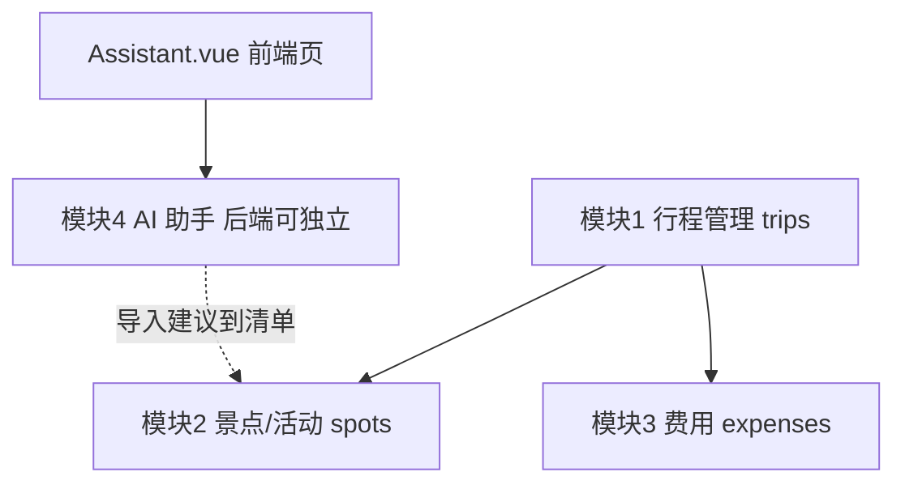

# TripMate Lite —— 产品需求与规划文档（PRD）

> **文档用途**：提交项目经理评审，作为 3 小时 MVP 开发与验收的唯一需求依据。  
> **产品定位**：AI 个人旅行助手 MVP · 单用户本地使用 · 无登录认证。  
> **开发约束**：单人独立开发，限时 180 分钟；接口契约以后续冻结的 `docs/API-CONTRACT.md` 为准。

---

## 1. 背景与目标

短途出行前，用户需要在短时间内把「去哪、玩什么、花多少」整理清楚，而不是打开一堆 App 东拼西凑。现有旅游平台功能过重（登录、预订、社交、地图），对「个人快速规划」场景成本过高。

**目标用户画像**：偶尔短途出行、愿意自己记账与列清单、需要一份可演示闭环的个人旅行整理工具的独立开发者/职场人。

**核心价值主张**：在本地、无登录的前提下，用「行程 → 清单 → 费用 → AI 建议」四个模块，30 秒内搭出一份可演示的短途出行小闭环。

**交付目标**：可演示的 MVP，而非完整旅游平台。演示路径固定为：新建行程 → 加景点/活动 → 记费用并看预算对比 → 用 AI（或 Mock）生成建议并可导入清单。

---

## 2. 功能范围

### 2.1 做什么（四个模块）

| 模块 | 名称 | 核心能力 | 完成判据（摘要） |
|------|------|----------|------------------|
| 模块1 | 行程管理 | 行程的增删改查；字段含名称、目的地、起止日期、预算、备注 | 列表可见；编辑落库；删除后列表与详情不可见 |
| 模块2 | 景点/活动清单 | 归属于某个行程的清单项；支持增删改；可改状态（待去/已去） | 行程详情内可管理；状态刷新后仍正确 |
| 模块3 | 费用记录 | 记账（新增/删除）；按行程汇总；与预算对比；超支提醒 | 合计正确；预算对比合理；超支有明确提示 |
| 模块4 | AI 行程助手 | 调用 DeepSeek 生成结构化行程建议；失败或无 Key 时 Mock 降级；支持将建议导入清单 | 有 Key 标真实调用；降级时页面可用且标识 Mock |

### 2.2 明确不做（范围红线）

| 不做项 | 为什么在 3 小时内放弃它是正确的 |
|--------|----------------------------------|
| 真实地图与导航 | 地图 SDK、Key、瓦片与权限会吃掉整段联调时间，且与「清单+记账」闭环无关 |
| 路径规划 | 依赖地图/路网与算法，超出 MVP 演示路径，砍掉不影响「去哪玩什么花多少」 |
| 第三方 POI 检索 | 对接高德/谷歌检索要鉴权与字段映射，手工录入清单项足够演示 |
| 支付订单票务 | 支付与票务是交易系统，不在个人本地助手边界内，接入即偏离产品叙事 |
| 社交分享评论 | 无多用户就没有社交对象；加分享会引入权限与内容审核噪声 |
| 多角色权限体系 | 产品明确单用户本地、无登录；做权限等于否定赛题前提并浪费校验时间 |
| 向量检索与 RAG | 知识库与向量库建设远超 3 小时；本 MVP 只需一次结构化 LLM 生成即可 |
| 移动端原生 App | 目标是 Web 可演示；原生双端打包与适配会挤占前后端闭环时间 |
| 复杂动画特效 | 演示看的是数据闭环与 AI 降级，不是动效；Element Plus 默认交互已够用 |

---

## 3. 数据实体

字段设计为**硬约束**，实现侧不得擅自增删改名或改类型语义。API JSON 一律 `camelCase`；库表列名 `snake_case`；金额为 `number`；日期为 `YYYY-MM-DD` 字符串。

### 3.1 trips（行程）

| 字段（API） | 类型 | 必填 | 约束说明 |
|-------------|------|------|----------|
| id | number / uuid（实现与契约对齐） | 是（只读） | 主键，创建时由服务端生成 |
| name | string | 是 | 行程名称，非空 |
| destination | string | 是 | 目的地，非空 |
| startDate | string (`YYYY-MM-DD`) | 是 | 开始日期 |
| endDate | string (`YYYY-MM-DD`) | 是 | 结束日期；业务上应 ≥ startDate（校验在契约/后端统一） |
| budget | number | 是 | 预算金额，数值类型 |
| note | string \| null | 否 | 备注；未传可为 null 或空串（与契约一致） |
| createdAt | string (ISO 时间) | 是（只读） | 创建时间，服务端生成 |

### 3.2 spots（景点/活动清单项）

| 字段（API） | 类型 | 必填 | 约束说明 |
|-------------|------|------|----------|
| id | number / uuid | 是（只读） | 主键 |
| tripId | number / uuid | 是 | 外键 → trips.id |
| name | string | 是 | 清单项名称，非空 |
| type | string 枚举 | 是 | 仅允许：`景点` / `餐饮` / `交通` / `其他` |
| estimatedCost | number | 否 | 未传时**入库为 0** |
| status | string 枚举 | 是 | 仅允许：`待去` / `已去` |
| createdAt | string (ISO 时间) | 是（只读） | 创建时间 |

### 3.3 expenses（费用）

| 字段（API） | 类型 | 必填 | 约束说明 |
|-------------|------|------|----------|
| id | number / uuid | 是（只读） | 主键 |
| tripId | number / uuid | 是 | 外键 → trips.id |
| name | string | 是 | 费用名称，非空 |
| amount | number | 是 | 金额，数值类型（注意 pg NUMERIC 解析，避免字符串相加） |
| category | string 枚举 | 是 | 仅允许：`交通` / `住宿` / `餐饮` / `门票` / `其他` |
| spendDate | string (`YYYY-MM-DD`) | 是 | 消费日期 |
| createdAt | string (ISO 时间) | 是（只读） | 创建时间 |

### 3.4 实体关系与费用范围边界

- **关系**：一个 `trip` 拥有多个 `spot`、多个 `expense`。
- **级联删除**：删除某个 `trip` 时，必须级联删除其下全部 `spot` 与 `expense`（DB 外键 `ON DELETE CASCADE` 或等价事务删除）。
- **费用模块 MVP 不做编辑接口**：费用仅支持**新增**与**删除**。若要改一笔费用 = 删除旧记录 + 新建新记录。此边界写入 PRD，避免评审将「无 PUT/PATCH」误判为功能缺失。

---

## 4. 模块依赖与开发优先级

### 4.1 依赖顺序

文字说明：

1. **行程模块是根**：无 `tripId` 则景点与费用无法挂载。
2. **景点、费用并行依赖行程**：二者互不依赖，可在行程 CRUD 可用后并行推进。
3. **AI 后端可独立开发**：Prompt、DeepSeek 调用、Mock 降级不依赖行程表结构；但「导入到清单」依赖景点模块（创建 spots）。
4. **前端助手页由 F 实现**，对接 A 提供的 AI API。

### 4.2 优先级与可砍幅度

| 优先级 | 范围 | 若时间不够可砍到的程度 |
|--------|------|------------------------|
| **P0** | 行程 CRUD；景点增删改与状态；费用新增/删除 + 按行程合计 + 预算对比 UI；统一错误与空态 | **不可再砍**。再砍则无法演示「去哪/玩什么/花多少」闭环 |
| **P1** | AI 真实调用 + Mock 降级 + 前端标识 `source`；建议列表渲染；导入为 spots（至少能导入若干条） | 可砍「导入」按钮，只保留「生成建议 + 展示 + source 标识」；仍算 AI 模块及格 |
| **P2** | 备注展示优化、分类筛选、费用分类小计、文案润色、非关键空态细化 | 可全部砍；不影响验收主路径 |

---

## 5. 三小时时间盒

总计 **180 分钟**。超时按「兜底策略」立刻降级，禁止恋战。

| 时段 | 分钟 | 任务 | 产出 | 超时兜底策略 |
|------|------|------|------|--------------|
| 0–20 | 20 | 规划：PRD 定稿、契约骨架、任务清单与验收条 | `docs/PRD.md`、契约草稿、日志留痕 | 契约只保留 P0 路径与三实体字段；细节争议记日志后冻结 |
| 20–55 | 35 | 后端 P0：schema + trips/spots/expenses API + NUMERIC 类型解析 | 可 curl 的 CRUD/汇总接口 | 费用编辑永不做；汇总先做服务端合计字段，前端只展示 |
| 55–85 | 30 | 前端 P0：行程列表/详情、景点列表与状态、费用列表与预算条 | 可点击演示的三模块页面 | 砍筛选与分类小计；表格+表单即可 |
| 85–115 | 30 | AI 后端：DeepSeek + Mock 同构响应；挂载路由 | `source`/`fallbackReason` 可用 | Key 不通则强制走 Mock，保证 200 不白屏 |
| 115–145 | 30 | 前端 AI 页 + 联调导入（P1）；修联调字段不一致 | Assistant 页可演示 | 砍导入，只展示建议与来源标识 |
| 145–170 | 25 | 测试：行程 CRUD、费用合计、AI Mock 强制失败仍 200 | 测试通过或手测清单打勾 | 自动化不够则用 `TESTING.md` 手测清单顶替，P0 必须手测通过 |
| 170–180 | 10 | 演示彩排 + 日志收尾 + 已知问题列表 | 可 3 分钟讲完的演示路径 | 只演示 P0；AI 用 Mock 也算达标 |

---

## 6. 多 Agent 协同方案

采用 **「阶段性并行 + 契约门禁」**：契约冻结前以 P 单线程输出文档；冻结后 B / F / A 按目录隔离并行；Q 在接口稳定后介入。人类 review 是单线程瓶颈，故**不做五人全并行**，避免无契约情况下互相猜字段。

### 6.1 角色表

| 角色 | 代号 | 职责 | 可写目录 / 例外 | 前置依赖 |
|------|------|------|-----------------|----------|
| 规划 | P | 需求、模块拆解、接口契约、任务清单、验收标准 | `docs/`、根目录 markdown；追加 `AGENT_LOG.md` | 无（最先启动） |
| 后端 | B | schema、repository、Express 路由/控制器、校验与错误处理 | 仅 `server/`；追加 `AGENT_LOG.md`；**阶段 5 可改根 `package.json` 的 `db:init` / `db:reset` scripts**（不得改 dependencies 或其他 scripts） | 契约冻结（至少 P0 接口） |
| 前端 | F | 页面、路由、组件、联调；**含 `Assistant.vue`** | 仅 `client/`；追加 `AGENT_LOG.md` | 契约冻结；联调需 B 的 P0 接口 |
| AI | A | DeepSeek 集成与 Mock 降级（**仅后端**） | `server/src/ai/`、`server/src/routes/ai.js`、`server/src/controllers/aiController.js`；`index.js` 仅允许挂载路由的最小改动；追加 `AGENT_LOG.md`；**严禁改 `client/`** | 契约中 AI 接口冻结；可与 B 的行程模块并行 |
| 测试 | Q | Vitest + Supertest、验收文档 | `server/tests/`、`server/vitest.config.js`、根 `TESTING.md`；脚手架最小改动：`index.js` / `db.js`（导出 app、test 不 listen、`TEST_DATABASE_URL`）；追加 `AGENT_LOG.md`；**不改业务逻辑** | P0 API 可用；AI 降级行为可测 |

### 6.2 边界对齐（与手册 §1.2 / 角色规则一致）

- **所有角色**均可追加根目录 `AGENT_LOG.md`（共享追加例外，不算目录越界）。
- **A 只做后端 AI**（`server/src/ai/` + AI 路由/controller）；**`Assistant.vue` 由 F 实现**。
- **Q** 可做测试脚手架最小改动（`index.js` / `db.js` / `vitest.config.js`），但**不改业务逻辑**；发现 bug 报告给对应角色。
- **B** 在阶段 5 可改根 `package.json` 的 `db:*` scripts，除此以外不改根目录业务实现文件。

### 6.3 并行节奏（建议）

1. **门禁 0**：P 产出 PRD + 契约 → 人类确认冻结。  
2. **并行 1**：B 做 schema + 三模块 API；A 做 AI 服务层；F 可先搭路由壳与静态表单（mock 数据仅本地，不得发明契约外字段）。  
3. **门禁 1**：P0 接口可联调 → F 接真实 API。  
4. **并行 2**：F 做 Assistant + 导入；A/B 修降级与校验边角。  
5. **门禁 2**：Q 跑自动化 / 手测清单 → 演示。

---

## 7. 验收标准

格式均为 **操作 → 预期结果**，评审时逐条勾选。

### 7.1 模块1 行程管理

- [ ] 打开行程列表（无数据）→ 显示空状态，不白屏。  
- [ ] 新建行程（填齐必填：名称、目的地、起止日期、预算）→ 提交成功提示；返回列表可见该行程。  
- [ ] 进入该行程并编辑（如改名称/预算）→ 保存成功；刷新后仍为新值。  
- [ ] 删除该行程并确认 → 列表中消失；再访问其详情应失败或回列表（与契约一致）。  
- [ ] 删除行程后 → 其下 spots、expenses 不可再查到（级联删除生效）。

### 7.2 模块2 景点/活动清单

- [ ] 进入某行程详情 → 可见景点/活动清单区域（可为空状态）。  
- [ ] 新增 2 个清单项（不同类型或同类型均可）→ 列表显示 2 条。  
- [ ] 将其中一个改为「已去」→ 界面立即显示新状态。  
- [ ] 刷新页面或重新进入详情 → 该条状态仍为「已去」（持久化成功）。  
- [ ] （可选 P1）未传 `estimatedCost` 新建 → 展示/回读为 0。

### 7.3 模块3 费用记录

- [ ] 在行程下新增 2 条费用（金额已知）→ 列表显示 2 条。  
- [ ] 查看费用合计 → 数值等于两笔 `amount` 之和（number 相加，非字符串拼接）。  
- [ ] 查看预算对比 → 展示「已花 / 预算」关系合理（如进度或差额文案）。  
- [ ] 当合计 > 预算时 → 有明确超支提醒（文案或样式警示）。  
- [ ] 删除其中一条费用 → 合计与预算对比同步更新。  
- [ ] 确认无「编辑费用」入口/接口被当作缺陷；改费用通过删旧建新完成。

### 7.4 模块4 AI 行程助手

- [ ] 配置有效 DeepSeek API Key 并成功调用 → 响应/页面标识为 **「DeepSeek 真实调用」**（对应 `source: deepseek`）。  
- [ ] 移除 Key，或强制失败（超时/错误 Key/校验失败等）→ 标识为 **「Mock 降级」**（对应 `source: mock`，宜含 `fallbackReason`），HTTP 仍成功。  
- [ ] 降级场景下 → 页面仍可渲染建议内容，**不白屏、不抛未捕获错误**。  
- [ ] Mock 与真实调用 → 前端可用同一套结构渲染（字段同构）。  
- [ ] （P1）若保留导入：将建议导入清单 → 对应行程下新增 spots；若已按时间盒砍导入 → 本条标为 N/A，不影响 AI 模块及格。

---

## 8. 风险与应对

| # | 风险 | 影响 | 应对 |
|---|------|------|------|
| 1 | DeepSeek 网络不通 / Key 无效 / 超时 | AI 演示失败或 5xx 白屏 | 强制 Mock 降级；接口任何情况不抛 5xx；前端按 `source` 展示「Mock 降级」仍可演示 |
| 2 | pg `NUMERIC` 返回字符串，费用合计变成字符串拼接或 NaN | 预算对比错误，验收直接挂 | 在 `db.js` 注册类型解析器，将 NUMERIC 转为 JS `number`；测试覆盖合计正确性 |
| 3 | 3 小时时间超支，功能做不完 | 演示无闭环 | 严格执行 §5 时间盒；按 P2→P1（导入）顺序砍；最后 10 分钟只保 P0 演示路径 |
| 4 | 前后端字段名/枚举/日期格式不一致 | 联调反复返工 | 契约先冻结；目录隔离禁止互相改对方代码；争议由 P 改契约并记 `AGENT_LOG.md` |
| 5 | 删除行程后子表残留或误删 | 数据脏、演示穿帮 | DB 级联或事务双删；验收勾选「删行程后 spots/expenses 不可见」 |
| 6 | Agent 越界改文件（如 A 改 `Assistant.vue`、Q 改业务 SQL） | 冲突与责任不清 | 严格按 §6 可写目录；越界改动在 review 时打回；一律用 `AGENT_LOG.md` 留痕交接 |

---

## 附录 A · 演示脚本（建议 3 分钟）

1. 新建「周末青岛两日游」，预算 1500。  
2. 加 2 个景点，将 1 个标为已去。  
3. 记 2 笔费用，展示合计与是否超支。  
4. 打开 AI 助手生成建议；若无网则展示 Mock 降级标识。  
5. （可选）导入 1～2 条建议到清单。

## 附录 B · 与后续文档的关系

| 文档 | 关系 |
|------|------|
| `docs/API-CONTRACT.md` | 接口唯一事实来源；本 PRD 定范围与实体，契约定路径/状态码/响应壳 |
| `TESTING.md` | 由 Q 维护；验收条应对齐本文 §7 |
| `AGENT_LOG.md` | 各角色任务留痕；契约变更必须记录原因与影响范围 |

---

**文档状态**：待项目经理评审。评审通过后，由 P 输出/冻结 `docs/API-CONTRACT.md`，再开启 B/F/A 并行开发。
`)